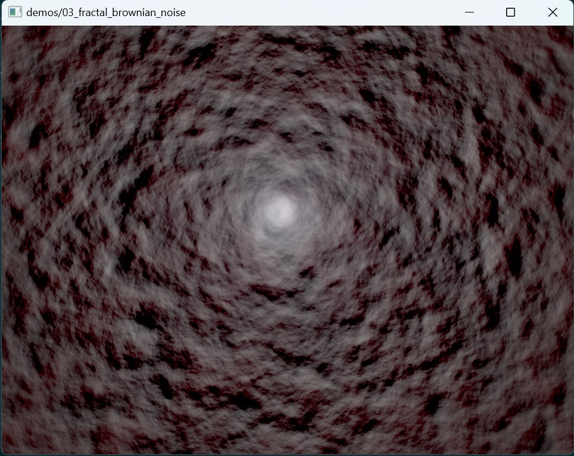

# Fractal Brownian Noise

```shell
cargo run --example live_reload -- @demos/03_fractal_brownian_noise/args
```



This demo explores two ideas:

1. Use multiple octaves of Value Noise to generate fractal noise.
2. Use Slang's support for automatic differentiation to generate fake lighting.
